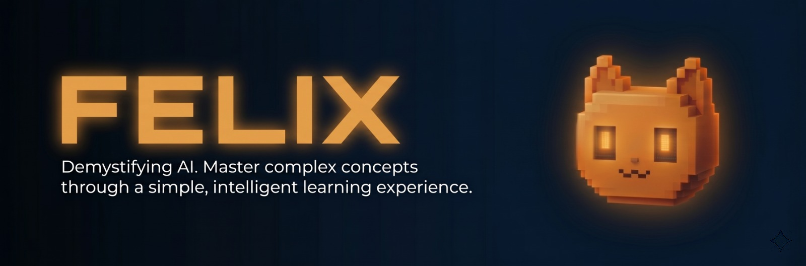
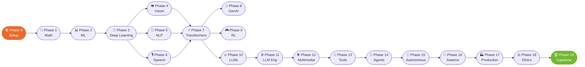

<div align="center">


# Felix

### *Framework for Enhanced Learning & Intelligent eXperience*


### *From linear algebra to autonomous agent swarms. Learn AI **with** AI, then ship the tools.*

<!-- Primary badges -->
[](LICENSE)
[](CONTRIBUTING.md)
[](https://felixforlearnai.com/catalog)
[](#-the-journey)
[](https://felixforlearnai.com/catalog)
[](https://github.com/cookie-may/felixforlearnai/stargazers)

<!-- Tech stack badges -->
[](#)
[](#)
[](#)
[](#)
[](#)
[](#)
[](#-ai-native-learning)
[](#)

### 🧭 Quick Navigation

[**🚀 Get Started**](#-getting-started) &nbsp;·&nbsp;
[**🤖 AI-Native**](#-ai-native-learning) &nbsp;·&nbsp;
[**🗺️ The Journey**](#-the-journey) &nbsp;·&nbsp;
[**🧰 Toolkit**](#-course-output-the-toolkit) &nbsp;·&nbsp;
[**📚 Glossary**](https://felixforlearnai.com/glossary) &nbsp;·&nbsp;
[**🌐 Website**](https://felixforlearnai.com) &nbsp;·&nbsp;
[**𝕏 Follow**](https://x.com/felixforlearnai)

</div>

---

<div align="center">

> ### 💬 *"84% of students already use AI tools. Only 18% feel prepared to use them professionally.*
> ### *Felix closes that gap."*

</div>

**272+ lessons. 20 phases. ~306 hours.** From linear algebra to autonomous agent swarms. Python, TypeScript, Rust, Julia. Every lesson produces something reusable: prompts, skills, agents, and MCP servers.

You don't just learn AI. You learn AI **with** AI. Then you build real things. Then you ship tools others can use.

<br/>

### 🆚 Why Felix?

<table>
<tr>
<th width="50%">📺 Traditional Courses</th>
<th width="50%">🧠 Felix</th>
</tr>
<tr>
<td><b>Scope</b><br/>One slice (NLP <i>or</i> Vision <i>or</i> Agents)</td>
<td><b>Scope</b><br/>🌍 Everything — math · ML · DL · NLP · vision · speech · transformers · LLMs · agents · swarms</td>
</tr>
<tr>
<td><b>Languages</b><br/>Python only</td>
<td><b>Languages</b><br/>🐍 Python · 🟦 TypeScript · 🦀 Rust · 🟣 Julia</td>
</tr>
<tr>
<td><b>Output</b><br/>"I learned something"</td>
<td><b>Output</b><br/>📦 A portfolio of tools, prompts, skills, and agents you can install</td>
</tr>
<tr>
<td><b>Depth</b><br/>Surface-level <i>or</i> theory-heavy</td>
<td><b>Depth</b><br/>🔬 Build from scratch first, <i>then</i> use frameworks</td>
</tr>
<tr>
<td><b>Format</b><br/>Videos you watch</td>
<td><b>Format</b><br/>💻 Runnable code + docs + web app + AI-powered quizzes</td>
</tr>
<tr>
<td><b>Style</b><br/>Passive consumption</td>
<td><b>Style</b><br/>🤖 AI-native — Claude Code skills test you as you go</td>
</tr>
</table>

---

<div align="center">

## 🤖 AI-Native Learning

### *This isn't a course you watch. It's a course you **use with your AI coding agent**.*

</div>

### 🎯 Learn with AI, not just about AI

```bash
# 🧪 Find where to start based on what you already know
/find-your-level

# ✅ Quiz yourself after completing a phase
/check-understanding 3

# 📦 Every lesson produces a reusable artifact
ls phases/03-deep-learning-core/05-loss-functions/outputs/
# ├── prompt-loss-function-selector.md
# └── prompt-loss-debugger.md
```

### 🚢 Every Lesson Ships Something

Other courses end with *"congratulations, you learned X."* Felix lessons end with a **reusable tool**:

<table>
<tr>
<td align="center" width="25%">

📝<br/>**Prompts**<br/>
<sub>Paste into any AI assistant for expert-level help</sub>

</td>
<td align="center" width="25%">

🎴<br/>**Skills**<br/>
<sub>Install into Claude Code, Cursor, or any agent</sub>

</td>
<td align="center" width="25%">

🤖<br/>**Agents**<br/>
<sub>Deploy as autonomous workers</sub>

</td>
<td align="center" width="25%">

🔌<br/>**MCP Servers**<br/>
<sub>Plug into any MCP-compatible AI app</sub>

</td>
</tr>
</table>

> 277-term searchable glossary. Full lesson catalog. ~306 hours of content with per-lesson time estimates.<br/>
> 🌐 [**Browse the website →**](https://felixforlearnai.com) &nbsp;·&nbsp; 𝕏 [**Follow updates →**](https://x.com/felixforlearnai)

---

<div align="center">

## 🗺️ The Learning Path



### *20 phases · 272+ lessons · from zero to swarms*

</div>

---

<div align="center">

## 📐 How Each Lesson Works

</div>

```
phases/XX-phase-name/NN-lesson-name/
├── 💻 code/           Runnable implementations (Python, TS, Rust, Julia)
├── 📖 docs/
│   └── en.md          Lesson documentation (rendered on felixforlearnai.com)
└── 📦 outputs/        Prompts, skills, agents produced by this lesson
```

### 🔄 Every lesson follows 6 steps

| Step | What happens |
|------|-------------|
| 🎯 **Motto** | One-line core idea that sticks |
| ❓ **Problem** | A concrete scenario where not knowing this hurts |
| 🧠 **Concept** | Mermaid diagrams and intuition — no code yet |
| 🔨 **Build It** | Implement from scratch in pure Python. No frameworks. |
| ⚙️ **Use It** | Same thing with PyTorch, sklearn, or the real tool |
| 🚢 **Ship It** | The prompt, skill, or agent this lesson produces |

> 🔑 The **Build It / Use It** split is the key. You understand what the framework does because you built it yourself first.

---

<div align="center">

## 🧰 Course Output: The Toolkit

### *Other courses give you a certificate. Felix gives you a **toolkit**.*

</div>

Every lesson produces a reusable artifact you can install and use immediately. By the end you have:

```
outputs/
├── 📝 prompts/         Prompt templates for every AI task
├── 🎴 skills/          SKILL.md files for AI coding agents
├── 🤖 agents/          Agent definitions ready to deploy
└── 🔌 mcp-servers/     MCP servers you built during the course
```

---

<div align="center">

## 🚀 Getting Started

</div>

### 🅰️ Option A — Browse the website

Visit [felixforlearnai.com](https://felixforlearnai.com), pick a phase, and start reading — no setup needed.

### 🅱️ Option B — Clone and run locally

```bash
git clone https://github.com/cookie-may/felixforlearnai.git
cd felixforlearnai
npm install && npm run dev
# Open http://localhost:3000
```

### 🅲 Option C — Jump to your level ⭐

```bash
# In Claude Code, run the built-in level finder:
/find-your-level
```

### ✅ Prerequisites

- [x] You can write code (any language)
- [x] You want to understand how AI **actually works**, not just call APIs

### 👤 Who This Is For

| 🧑‍💻 You are... | 🚪 Start at... | ⏱️ Time |
|---------------|----------------|---------|
| 🌱 New to programming + AI | Phase 0 — Setup | ~306 hours |
| 🐍 Know Python, new to ML | Phase 1 — Math | ~270 hours |
| 📊 Know ML, new to DL | Phase 3 — Deep Learning | ~200 hours |
| 🧠 Know DL, want LLMs/agents | Phase 10 — LLMs from Scratch | ~100 hours |
| 🚀 Senior eng, want agents only | Phase 14 — Agent Engineering | ~60 hours |

---

<div align="center">

## 🤝 Contributing

We welcome contributions — new lessons, translations, fixes, and outputs.

| 📋 Want to... | 👉 Read |
|--------------|--------|
| Contribute a lesson or fix | [CONTRIBUTING.md](CONTRIBUTING.md) |
| See the lesson template | [LESSON_TEMPLATE.md](LESSON_TEMPLATE.md) |
| Track progress | [ROADMAP.md](ROADMAP.md) |

---

### 🌟 If Felix helped you, please star the repo — it keeps the project alive.

### 💚 Built with care for the AI engineering community.

[](https://x.com/felixforlearnai)
[](https://felixforlearnai.com)
[](https://github.com/cookie-may/felixforlearnai)

<sub><b>📜 MIT License</b> — Use it however you want. Fork it. Teach it. Ship it.</sub>

<sub>✨ <i>From linear algebra to autonomous agent swarms — one lesson at a time.</i> ✨</sub>

</div>
